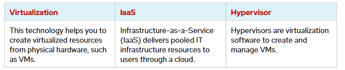

## Introduction to OpenShift Virtualization

Red Hat OpenShift Container Platform (RHOCP) is a set of modular components and services that are built on top of Kubernetes container infrastructure. The RHOCP software product is derived from the Kubernetes open source project. Although RHOCP and Kubernetes are container orchestration software, RHOCP is packaged as a downstream enterprise open source platform.

## Features of Red Hat OpenShift Container Platform

RHOCP includes these features for cluster management:

### Developer workflow 
Integrates a built-in container registry, Continuous Integration/Continuous Delivery (CI/CD) pipelines, and Source-to-Image (S2I), a tool to build artifacts from source repositories to container images.

### Routes
Exposes services to infrastructure segments or to the outside world

### Metrics and Logging
Includes a built-in and self-analyzing metrics service and aggregated logging based on the upstream Prometheus project.

### Unified UI 
Provides a unified toolset and an integrated UI to manage the cluster functions.

Red Hat builds key features such as Stateful Sets, role-based access control (RBAC), and network policies. Red Hat also provides critical components of Kubernetes such as the etcd key-value store, which is the cornerstone of Kubernetes that maintains cluster configuration.

## Red Hat OpenShift Virtualization
Red Hat OpenShift Virtualization is a Kubernetes operator on RHOCP, and is based on the KubeVirt Kubernetes virtualization add-on, which enables managing VM workloads alongside container workloads.

KubeVirt delivers container-native virtualization by using the Kernel-based Virtual Machine (KVM) Linux Kernel hypervisor within a Kubernetes container. KubeVirt includes similar services to traditional virtualization platforms, to provide the best of mature virtualization management
technology and Kubernetes container orchestration. Started by Red Hat, KubeVirt is now a Cloud Native Computing Foundation Incubation project and an open source upstream project.

The following figure shows the resources and services that comprise an RHOCP cluster, which includes the self-service administrator command-line and web interfaces:

With the OpenShift Virtualization operator, the cluster uses these resources to manage virtual machines. The cluster API server communicates with the virt-controller process to orchestrate virtual machine requests. A DaemonSet pod that contains the virt-handler process coordinates with the VM pod that runs the virt-launcher process to deliver the VM actions. Within the VM pod, the 'libvirtd' daemon provides the functionality for performing specific VM actions at the kernel level.

## Benefits of OpenShift Virtualization

Adding OpenShift Virtualization to an RHOCP cluster enables deploying and managing virtualized workloads with the same hardware, environment, and tool set that the containerized applications use. Managing virtual machines alongside containerized deployments in a single cluster provides
both administrative and economical advantages. Using OpenShift Virtualization unifies the management interfaces that system administrators use, to improve application reliability while reducing operational overhead.

Some benefits of managing VMs through OpenShift Virtualization are as follows:

• Provides new custom resource definitions (CRDs) and controllers to extend Kubernetes functions by enabling virtualization-related tasks.
• Supports creating and managing Linux and Windows VMs by using custom resources (CRs), the web console, the CLI, and YAML definition templates to customize VMs easily.
• Enables creating VMs by cloning a persistent volume claim (PVC) that points to an existing VM's persistent volume (PV).
• Supports importing and managing VMs that are created outside the OpenShift cluster.
• Permits moving a Virtual Machine Instance (VMI) and its resources between cluster nodes with
the help of live migration strategies, which eliminates the need to stop VMs before moving them.

## Features of OpenShift Virtualization
You can use OpenShift Virtualization to administer both VMs and all the resources that are required to manage them:

### Storage management
Manage storage by assigning to a VM a PV that contains your application files.

### Containerized Data Importer (CDI)
An upstream Kubernetes component that delivers a hardware agnostic management layer for storage volumes that attach to deployed instances.

### Network management
Attach network interfaces to VMs to expose your application connections and services.

### Virtual machine consoles
Connect to VMs by using command-line tools, the web console, and common protocols, such as Remote Desktop Protocol (RDP) for Windows VMs, and SSH.

### Workloads management
Manage virtualized workloads in the same unified platform.

### Side-by-side and consistent management
Manage containers and VMs side by side, for a flexible, agile working environment that centralizes infrastructure management.

### Common infrastructure
Support deploying and managing virtual machines alongside containerized deployments by sharing common infrastructure and robust management tools, including the web console and API.

### Pipelines for VMs (CI/CD)
Use one pipeline to test applications in both containers and VMs

## Management with Kubernetes resources
Manage virtual resources, either with the resources that RHOCP offers or with Kubernetes resources by using the command line. You can use the OpenShift command-line tool to create and manage VMs, similar to VMware's PowerCLI and govc.

## Standalone VMIs
Use the command line and the web console to manage standalone VMIs that were created independently from the OpenShift cluster, such as VMIs that were created by using scripts, with automation, or other command line methods.

Virtualization and cloud computing are often confused because both concepts relate to the management of virtualized resources. The following table defines virtualization, Infrastructure-as-a-Service (IaaS), and hypervisor technology:

## Virtualization Components

The following virtual components are provided by KubeVirt:

#### virt-api

A cluster-level component that provides an HTTP RESTful entry point to manage VM and VM-related workflows within the cluster. It updates virtualization CRDS and handles defaulting and validating VMI CRDs.

#### virt-controller

A cluster-level component that handles cluster-wide virtualization functions and manages the lifecycle of pods that are associated with VMIs. The operator creates the pod where the VM objects execute.

#### virt-handler

A host-level DaemonSet resource that runs on each node, which monitors for changes to a VM object and runs the necessary operations to meet the required state.

#### virt-launcher

The primary container in a VMI-associated pod runs the virt-launcher component to provide control groups (cgroups) and namespaces for hosting the VMI process. This processing occurs when the virt-handler component passes the VM CRD object to the virt-launcher component. The virt-launcher component uses a container-local libvirtd instance to start the VMI. The virt-launcher component then monitors the
VMI process until the process exits at VMI termination.

#### libvirtd

Every VMI pod has a libvirtd instance for the virt-launcher component to manage the lifecycle of a VMI process.

## OpenShift Virtualization Operators and Components

OpenShift Virtualization supports managing and orchestrating VMs with similar tooling and methodology as for container management. With these shared tools and methods, administrators and developers can centralize infrastructure management.

The following operators and components are integrated for the OpenShift Virtualization operator:

#### HyperConverged Operator (HCO)
The HCO deploys and manages virtualization components and supplemental operators, such as the Containerized Data Importer (CDI), for OpenShift Virtualization.

#### KubeVirt
KubeVirt is an open source technology to enable running VMs in RHOCP with the OpenShift Virtualization operator. KubeVirt runs and manages traditional VMs as if they were containers.

In contrast to Kubevirt, Kata Containers is an Open Container Initiative (OCI) runtime to build lightweight VMs with containers inside, so each container can run on its own kernel. Kata Containers runs application containers within VMs to increase their isolation from a security perspective.

#### Hostpath Provisioner Operator (HPP)
The HPP operator is a local storage provisioner for virtual machines. Local storage or mounted volumes on nodes can be provisioned to VMIs.

#### QEMU agent
The Quick EMUlator (QEMU) guest agent is a daemon that runs inside the VM and passes information to the host about the VM, users, file systems, and secondary networks.

#### Kernel-based Virtual Machine (KVM)
KVM is an open source virtualization technology that is built into the Linux kernel that enables
a host machine to run multiple, isolated virtual environments, guest VMs.

