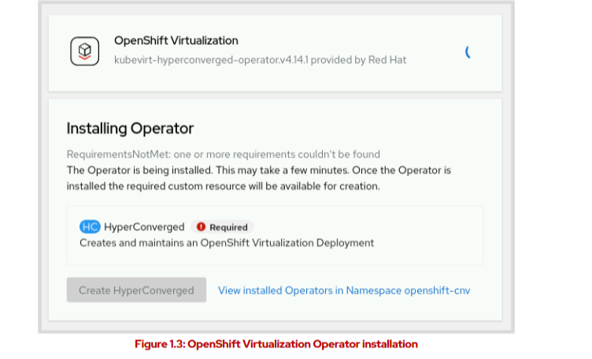
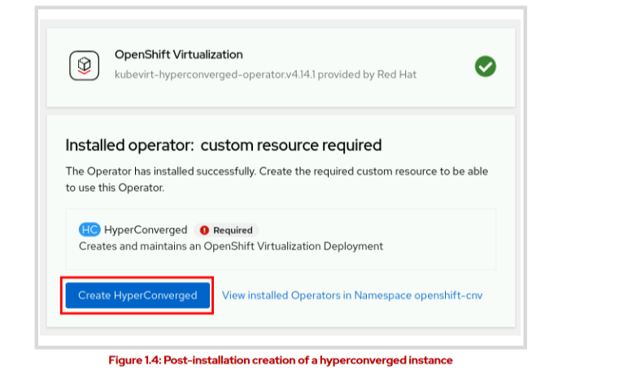

# Installing the Red Hat OpenShift Virtualization Operator

As with other operators, you can install the Red Hat OpenShift Virtualization operator by using either the web console or the command line. To install the operator by using the web console, navigate to Operators > Operator Hub in the left panel. Type OpenShift Virtualization in the search bar, and select OpenShift Virtualization. 

Configure your preferred channel and version options and click Install to open the Install Operator page. Review or augment the installation options and click Install to deploy the operator to the openshift-cnv namespace.

OpenShift Virtualization requires that the KubeVirt HyperConverged Operator (HCO) is installed in order to create virtual machines. The HCO deploys and manages OpenShift Virtualization and its components. The HCO also creates Custom Resources (CR) to deploy and manage supplemental operators for OpenShift Virtualization. These CRs include the Containerized Data Importer operator, the Scheduling, Scale, and Performance operator, and the Cluster Network Addons operator.

When the OpenShift Virtualization operator installs successfully, the web console displays a prompt to create a HyperConverged instance.

Click Create HyperConverged to create a HyperConverged instance in your cluster.

# Installation From the Command Line

To use the command-line installation method, create a YAML file to define the needed components for the subscription, and apply it by using the oc apply -f file.yaml command.

Click Create HyperConverged to create a HyperConverged instance in your cluster.

To use the command-line installation method, create a YAML file to define the needed
components for the subscription, and apply it by using the oc apply -f file.yaml command.

    ---
    apiVersion: v1
    kind: Namespace
    metadata:
      name: openshift-cnv
    ---
    apiVersion: operators.coreos.com/v1
    kind: OperatorGroup
    metadata:
      name: kubevirt-hyperconverged-group
      namespace: openshift-cnv
    spec:
      targetNamespaces:
        - openshift-cnv
    ---
    apiVersion: operators.coreos.com/v1alpha1
    kind: Subscription
    metadata:
      name: hco-operatorhub
      namespace: openshift-cnv
    spec:
      source: redhat-operators
      sourceNamespace: openshift-marketplace
      name: kubevirt-hyperconverged
      startingCSV: kubevirt-hyperconverged-operator.v4.14.1
      channel: "stable"

- The project namespace for the virtualization operator installation (default: openshift-cnv)
- The specific operator version to install
- The source channel for the operator installation

After applying the subscription, create a YAML file to define the HCO operator, and apply it by
using the oc apply -f file.yaml command.

    apiVersion: hco.kubevirt.io/v1beta1
    kind: HyperConverged
    metadata:
      name: kubevirt-hyperconverged
      namespace: openshift-cnv
    spec:

- The required object type
- The project namespace that is specified during operator installation

# The Hostpath Provisioner and Local Storage

By using the HostPathProvisioner (HPP) custom resource, you can create virtual machines that use local node storage. In an environment without available network storage, you can deploy the hostpath provisioner to provision VMs on a node's local storage. Additionally, you can use local
storage to troubleshoot performance issues for a virtual machine if you suspect that the root cause is the network storage.

With the hostpath provisioner, a virtual machine is backed by a local directory on the host node. The hostpath provisioner must be scheduled on nodes that are also scheduled for virtualization pods.

# Deployment Strategy for OpenShift Virtualization Supplemental Operators and Workloads
You can specify nodes by using node selectors, affinity rules, and tolerations for different virtualization workloads. With these tools, you can specify on which nodes virtualization components are placed. Node placement rules can be specified for both virtual machines and for
operators. To set node placement rules, specify Node Placement under Workloads or Infra during deployment, or edit the YAML file for the chosen object after deployment.

#### Node Selector
A nodeSelector object defines node placement by using labels. You can specify multiple labels, but all specified labels must be present for the node to be selected. Specify a node selector by editing the YAML of an object during or after deployment to include the key-value pair of one of the following selectors:

- spec.config.nodePlacement.nodeSelector
Defines the node selector for operators, such as the HCO, that the Operator Lifecycle Manager (OLM) deploys during operator installation. To use the selector, you must edit the Subscription object for the hco-operatorhub during the OpenShift Virtualization operator installation.

- spec.infra.nodePlacement.nodeSelector
Defines the nodes for supplemental components and operators, such as the Containerized Data Importer operator, that the HCO deploys, and that can be used during or after the OpenShift Virtualization operator installation.

- spec.workloads.nodePlacement.nodeSelector
Defines the nodes that the HCO can use to deploy workloads, and that can be used during or after the OpenShift Virtualization operator installation.

#### Affinity
Affinity rules specify node placement with more flexibility than the node selector. When
determining scheduling, you can use affinity to select or avoid specific nodes.
To establish affinity rules, adjust Affinity under Node Placement during deployment, or
edit the YAML of an object to include an entry under spec.affinity.nodeAffinity.

#### Toleration
Tolerations define node placement with node taints. Taints and tolerations work similarly to
labels and node selectors, but include a specified effect. The effect determines whether the scheduler assigns pods with a toleration to a node with a matching taint and what to do
with existing pods on a node that do not match. Specify toleration by adjusting Toleration
under Node Placement during deployment, or edit the YAML file of an object to include an
entry under spec.config.tolerations. 

# Virtual Machine Creation
You can create virtual machines by using the OpenShift Virtualization catalog, which provides virtual machine templates and instance types for various operating systems, including Red Hat Enterprise Linux and Microsoft Windows. To access the catalog, use the OpenShift web console
and navigate to Virtualization > Catalog. 

You can also create virtual machines by using volumes, the Quick Start guided tour, or by applying
a YAML file in the web console or from the command line.

To begin the Quick Start guided tour, select Help > Quick Starts. The Help menu is represented by a ? icon. A search field is available to find quick start guides that relate to virtualization, if available in the cluster. Several virtualization-related quick start guides exist, to introduce various OpenShift Virtualization features. These guides assist new administrators with such tasks as creating VMs from templates or volumes, and uploading a boot source.

After selecting a Quick Start guide, click Start to begin the guided tour. After completing the Quick Start guide, you can access the new virtual machine by navigating to Virtualization > VirtualMachines.