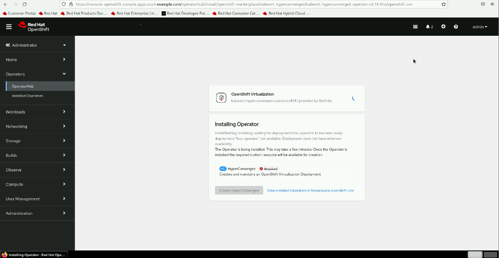

## Instructions

1. Open a web browser and log in to https://console-openshift-console.apps.ocp4.example.com from the workstation machine.

    1.1   Click htpasswd_provider and log in as the admin user with redhatocp as the password.

2. From the RHOCP web console left panel, navigate to Operators → OperatorHub. If you do not see the left panel, then click the main menu icon at the upper left of the web console.

3. Type virtualization in the OperatorHub search bar. Scroll down and select OpenShift Virtualization from the list.

 
 
 
 

4. From the Operator page, click **Install** to open the **Install Operator** page.

Review the available installation options. For this exercise, keep the default options:

- **Update channel** is set to **stable**.
- **Version** is set to **4.14.1**.
- **Installation mode** is set to **A specific namespace on the cluster**.
- **Installed Namespace** is set to **Operator recommended Namespace: openshift-cnv**.
- **Update approval** is set to **Automatic**.
- Click **Install** to initiate the operator installation.

 
 
 
 
 
 

5. Create a HyperConverged instance.

-  After the OpenShift Virtualization operator installation completes, you are prompted to **create a HyperConverged instance**. Click Create HyperConverged to view the options for the HyperConverged instance.

 
 
 

-  Accept the default options and click Create in the lower left of the window.

 

-  Wait for the operation to finish. The kubevirt-hyperconverged HyperConverged instance displays a status of Conditions: ReconcileComplete, Available, Upgradable when the operation completes.

6.  Log out of the web console, and log in as the admin user to ensure that the Virtualization entry appears in the side panel.

7.  From the OpenShift web console left panel, navigate to Operators → Installed Operators to confirm that the OpenShift Virtualization installation succeeded.

8. Create a project and a simple VM to confirm the functionality of OpenShift Virtualization.

-  From the OpenShift web console left panel, navigate to **Virtualization → VirtualMachines**.
-  From the **Project** menu, click Create **Project**.
-  Name the project as **test-vms**, and then click **Create**.
-  Click **Create virtual machine**, select the **From template** option, and then select the **CentOS Stream 9 VM Template**.
-  Enter the virtual machine name **centos-test** and click **Quick create VirtualMachine**.

9. From the resulting details page for the VM, monitor the deployment of the VM until the status is Running.

10. Remove the deployed test VM.

    10.1. Select **Actions → Delete**.

