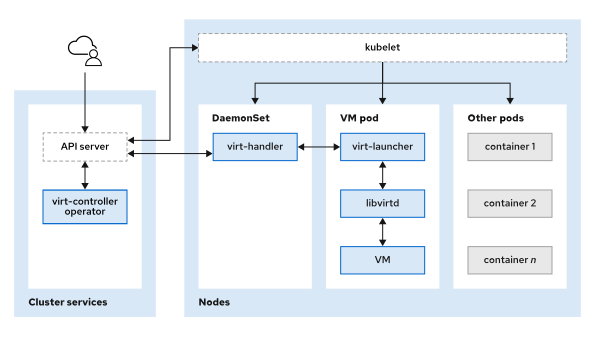

# Virtual Machine Resources 

### Objectives

- Describe and compare virtual machine instance components.

### Workload Controllers
Red Hat OpenShift Container Platform (RHOCP) offers a set of resources to help you run applications inside your cluster. Pods execute containers within an OpenShift cluster.

The pod resource can execute one or more containers. These resources consist of your running application instances, and you can interact with them by using pod management tools.

In Kubernetes, workload resources manage applications to reduce the need to interact with your application's pod directly.

The most common workload resources are explained next.

### Deployments
A deployment object is a resource that uses pod templates to describe the intended state of your application and its components. Deployments use this template to create a running instance of your application. A deployment interacts with a replica set resource to ensure that your application has the intended number of pods. Deployments enable declaratively managing application pods.

### Replica Sets
A replica set resource, whether used independently or by a deployment, ensures that the specified quantity of pod replicas are available in a healthy state. Replica sets use set-based selectors, which are filtered by key values, to identify pods in the cluster. Replica sets create, update, or delete pods automatically to maintain the specified state from the deployment.

### Daemon Sets
A daemon set resource ensures that a pod runs on every selected node. Unlike a replica set resource, a daemon set resource is not bound by a specific number of replicas.

The daemon set automatically creates a pod on the node when a new node, with a matching node selector, is added to the cluster. If a daemon set resource is deleted, then the cluster automatically cleans up the associated pods.

### Stateful Sets
A stateful set is a set of pods that execute stateful applications with consistent, unique identities (network and storage). The stateful set workload resource is useful to point to the same storage identity to maintain the application's persistent data.

# Difference Between Workload Controllers, VMs, and VMIs
In general, a virtual machine (VM) is a virtual environment that simulates the resources of a physical machine, which include CPU, memory, network interfaces, and storage. Typically, VMs maintain application state and persistent data, similar to the StatefulSet pods.

In Red Hat OpenShift Virtualization, a VM object specifies a template to create a running instance of the VM inside your cluster. The running instance of a VM is a virtual machine instance (VMI). A container inside a pod executes and manages the VMI.

The relationship between a VM and a VMI is similar to the relationship between a deployment and a replica set. A VM object specifies the template for a VMI pod. If a VMI is deleted, then Kubernetes generates another instance that is based on the VM object configuration.

When a VM is created and started, a virt-controller pod signals to a virt-handler pod on a cluster node to create a virt-launcher pod for the VMI. The virt-launcher pod consists of a running libvirtd container instance to execute the VMI as an isolated process.

# Components of an OpenShift Virtual Machine

Because VMIs exist in pods, they have components to execute and maintain the health of the workload. These components include console access, network interfaces, persistent volumes and persistent volume claims, and virt-launcher pods.

### Virtual Machine Consoles

Red Hat OpenShift Virtualization provides three consoles to access and manage VMIs:

### VNC Console

The Virtual Network Computing (VNC) console connects you to the VMI console through VNC. The VNC console provides both text-based and graphical consoles, depending on the configuration of the VMI's operating system. VNC is the default selection when you access the Console tab of a VMI through the OpenShift web console.

### Serial Console

The serial console connects you to the VMI's text-based console through its serial port.

### RDP Console

The Remote Desktop Protocol (RDP) console provides a graphical console through the RDP for Windows-based VMIs. The Quick Emulator (QEMU) guest agent must be installed and running on the VMI to use the RDP.

When using the OpenShift web console, you can switch between the various console types.

### Network Interfaces

When you attach a network interface to a VM, you have several options, such as connecting to the pod network or to external networks.

### Default Pod Network

The default pod network assigns an IP address to the VMI from the cluster's pod network. To use the default pod network, the network interface must use the Masquerade binding method. A masquerade binding uses NAT to enable other pods in the cluster to communicate with the VMI. By default, as with other pods on the pod network, the VMI is accessible only within the cluster.

### Multus

You can connect a VM to multiple interfaces and to external networks with the Container Network Interface (CNI) plug-in, Multus. To connect to an external network, you must create a linux-bridge network attachment definition that exposes the layer-2 device to a specific namespace.

### Single Root I/O Virtualization

A VMI can also use a Single Root I/O Virtualization (SR-IOV) device that enables a VMI to connect to a virtual function network for high performance. A SR-IOV device can be attached as a secondary network on the VMI. The SR-IOV standard enables multiple VMIs to share a single network device.

### Persistent Volumes and Persistent Volume Claims

A persistent volume (PV) is a storage resource that the persistent volume API object provisions. It represents existing storage within the cluster. You can attach a PV to a VMI by defining a Persistent Volume Claim (PVC), which represents a request for a specific storage resource.
Note

Persistent volumes and other storage management concepts are explained later in the course.

### VMI Execution Pods

When a VM object is started, the virt-handler daemon creates a virt-launcher pod. The virt-launcher pod manages and executes the VMI with a libvirtd container instance.

When the VMI is provisioned, the virt-launcher pod routes IPv4 traffic to the Dynamic Host Configuration Protocol (DHCP) address of the VMI. This routing also enables connecting to a VMI with a port-forwarding connection.

### Stand-alone VMIs

You can create a stand-alone VMI from the command line or by using an automation script. Use the web-console or oc commands on the command line to manage stand-alone VMIs, similarly to how a VM resource manages a VMI.

To list all the VMIs in the cluster, including stand-alone VMIs, use the oc get vmis command.

    [user@host ~]$ oc get vmis