# Guided Exercise: Create and Access a Virtual Machine

Create a Red Hat Enterprise Linux VM from an existing MariaDB image and use it to manage a database server.

## Outcomes

- Create a VM.

- Access the VNC console with the virtctl command.

- Access the database with the oc port-forward command.

- Manage the VM from the command line.

# Instructions

1. As the admin user, locate and navigate to the Red Hat OpenShift web console.

1.1. Use the command line to log in to your Red Hat OpenShift cluster as the admin user.

    [student@workstation ~]$ oc login -u admin -p redhatocp https://api.ocp4.example.com:6443
    Login Successful
    ...output omitted...

1.2. Identify the URL for the OpenShift web console.

    [student@workstation ~]$ oc whoami --show-console  https://console-openshift-console.apps.ocp4.example.com

1.3. Open a web browser and navigate to https://console-openshift-console.apps.ocp4.example.com.

1.4. Click htpasswd_provider and log in as the admin user with redhatocp as the password.

2. Create a VM that contains a preconfigured MariaDB database server.

2.1. From the OpenShift web console, locate the left panel. If you do not see the left panel, then click the main menu icon at the upper left of the web console.

2.2. Navigate to Virtualization → VirtualMachines. From the Project search field, select the creating-accessing-vms project from the list.
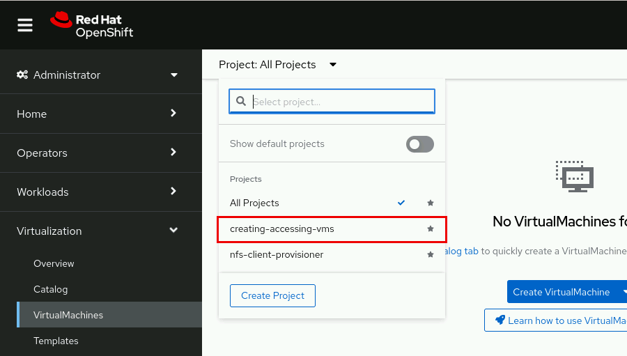

2.3. Navigate to Create virtual machine → From template.
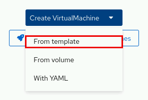

2.4. Select the Red Hat Enterprise Linux 9 VM template and click the Customize VirtualMachine button.
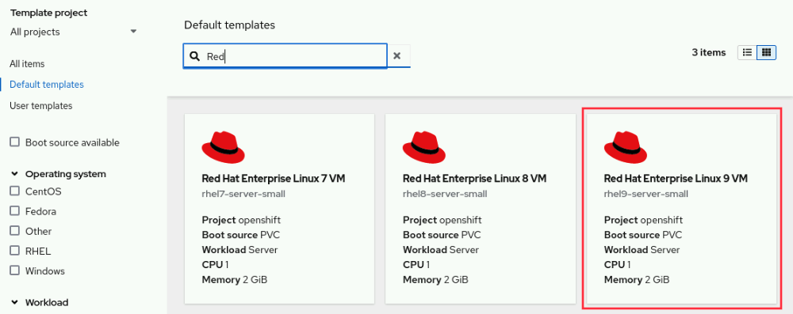     

2.5. On the Customize template parameters page, specify databasevm as the VM name.

2.6. For Disk source, select the URL (creates PVC) option.

2.7. Specify http://utility.lab.example.com:8080/openshift4/images/rhel9-mariadb.qcow2 in the Image URL field.
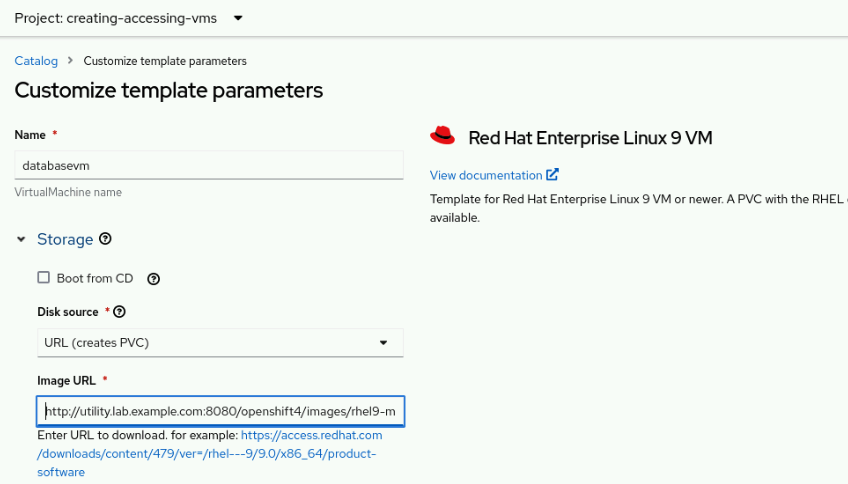

2.8. From the Optional parameters section, enter redhat123 for the CLOUD_USER_PASSWORD field.
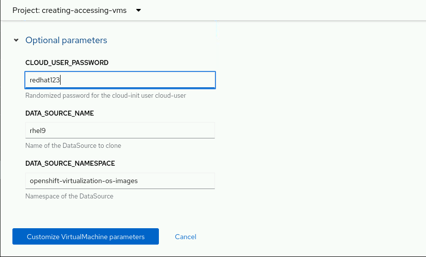

2.9. Click the Customize VirtualMachine parameters button.

2.10. Select the Scripts tab and then click the Cloud-init Edit icon.
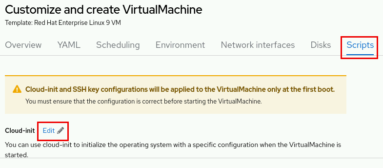

2.11. Change the Cloud-init user to operator1 and click Apply.
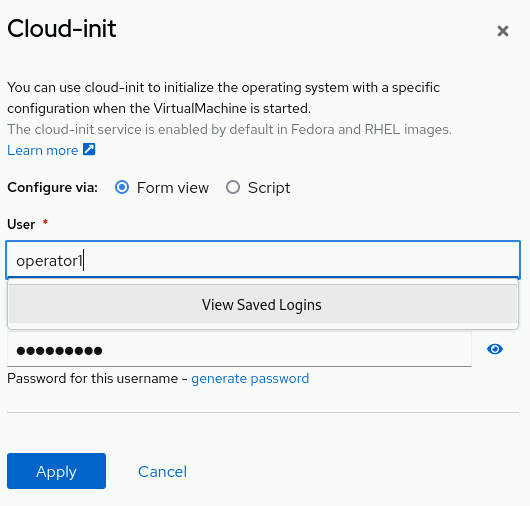

2.12. Navigate to the Overview tab. Click the edit icon for CPU | Memory.
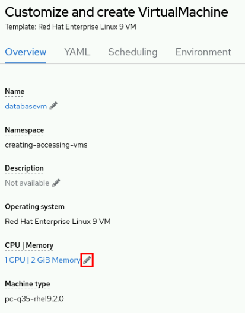

Increase the memory value to 4 GiB and click Save.
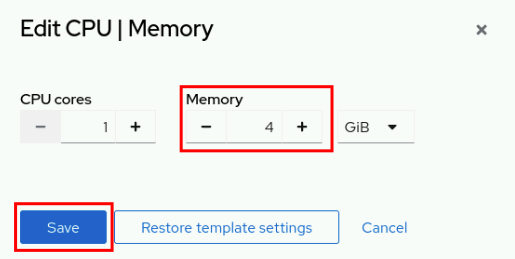

2.13. Select the Network Interface tab and confirm that the network interface type is masquerade.
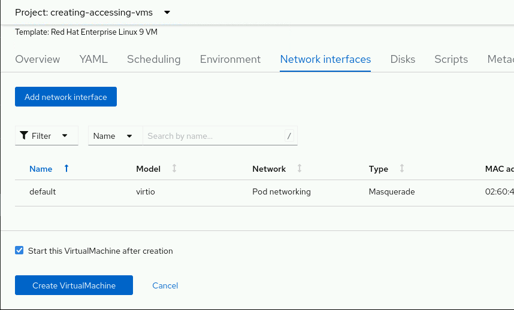

2.14. Select the Disk tab and confirm that the attached disks include cloudinitdisk and rootdisk.
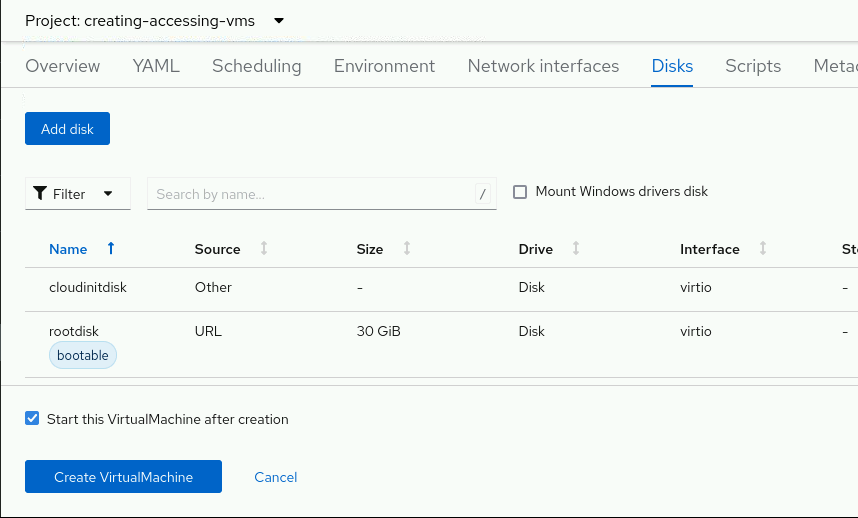

2.15. Review the settings and click Create Virtual Machine to create the VM.
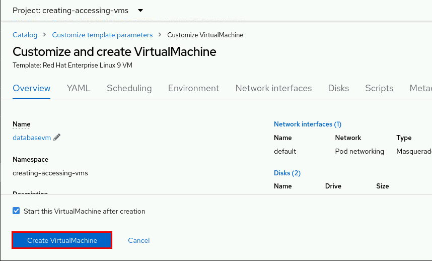

3. Review the details of your new VM.

3.1. From the VM Overview tab, wait until the Status changes to Running before continuing this exercise.
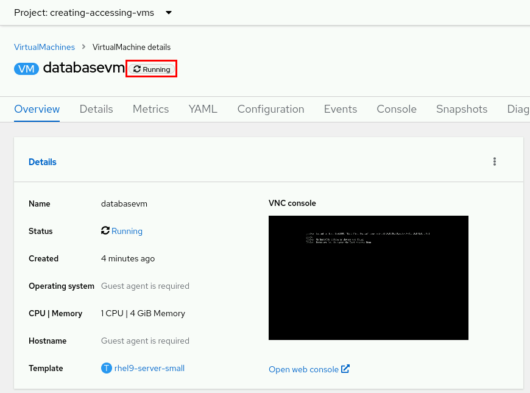

4. Access the VNC console with the virtctl command and retrieve the status of the database server.

4.1. From a command-line window, select the creating-accessing-vms project.

    [student@workstation ~]$ oc project creating-accessing-vms
Now using project "creating-accessing-vms" on server ...

4.2. List the available VM instances.

    [student@workstation ~]$ oc get vmi
    NAME            AGE   PHASE     IP          NODENAME   READY
    databasevm      3m    Running   10.8.2.12   worker02   True

4.3. Open a new command-line window and use the virtctl vnc command to access the VM's VNC console.

    [student@workstation ~]$ virtctl vnc databasevm

Log in to the console as the operator1 user with redhat123 as the password, as previously defined in the Optional parameters settings.

    Red Hat Enterprise Linux 9.3 (Plow)
    ...output omitted...
    databasevm login: operator1
    Password: redhat123
    [operator1@databasevm ~]$

Note
You can find the credentials in the OpenShift web console. Navigate to Virtualization → VirtualMachines and select your VM. Click the Console tab and then click Guest login credentials.

4.4. Retrieve the status of the database server.

    [operator1@databasevm ~]$ systemctl status mariadb
    mariadb.service - MariaDB 10.5 database server
    Loaded: loaded (/usr/lib/systemd/system/mariadb.service; enabled)...
    Active: active (running)...
    ...output omitted...

5. Access the MariaDB service with the oc port-forward command.

5.1. Open a new command-line window and use the oc get pods command to determine the name of the virt-launcher pod of the VMI. Your virt-launcher pod has a different name from the following example.

    [student@workstation ~]$ oc get pods
    NAME                             READY   STATUS    RESTARTS   AGE
    virt-launcher-databasevm-g92gf   1/1     Running   0          9m22s

    [student@workstation ~]$ PODNAME=virt-launcher-databasevm-g92gf
    [student@workstation ~]$ echo $PODNAME
    virt-launcher-databasevm-g92gf

5.2. Use the oc port-forward command to connect to the virt-launcher pod of the VMI. Specify the 33066:3306 ports.

    [student@workstation ~]$ oc port-forward $PODNAME 33066:3306
    Forwarding from 127.0.0.1:33066 -> 3306
    Forwarding from [::1]:33066 -> 3306
A successful connection does not return your console to the command-line prompt. This behavior is expected.

5.3. Open another command-line window and use the mysql command to connect to the MariaDB database on 127.0.0.1. Log in as the devuser user with developer as the password, and specify the port with the -P 33066 option.

    [student@workstation ~]$ mysql -u devuser -h 127.0.0.1 -P 33066 -p
    Enter password: developer
    Welcome to the MySQL monitor.  Commands end with ; or \g.
    ...output omitted...

5.4. The VM already contains a loaded database named sakila that has several tables. Retrieve the data from the actor and city tables.

    mysql> use sakila
    ...output omitted...
     Database changed
    mysql> select * from actor;
    +----------+-------------+--------------+---------------------+
    | actor_id | first_name  | last_name    | last_update         |
    +----------+-------------+--------------+---------------------+
    ...output omitted...

    mysql> select * from city;
    +---------+----------------------------+------------+---------------------+
    | city_id | city                       | country_id | last_update         |
    +---------+----------------------------+------------+---------------------+
    ...output omitted...

5.5. Exit the database.

    mysql> exit
    Bye

5.6. Return to the command line that is executing the oc port-forward command. Press Ctrl+C to end the connection.

    [student@workstation ~]$ oc port-forward $PODNAME 33066:3306
    Forwarding from 127.0.0.1:33066 -> 3306
    Forwarding from [::1]:33066 -> 3306
    Handling connection for 33066
    ^C
    [student@workstation ~]$

6. Manage the VM instance from the command line.

6.1. Use the virtctl command to stop the VMI and then delete the VM with the oc delete command.

    [student@workstation ~]$ oc get vmi
    NAME                      AGE   PHASE     IP          NODENAME    READY
    databasevm                3m    Running   10.8.2.12   worker02    True

    [student@workstation ~]$ virtctl stop databasevm
    VM databasevm was scheduled to stop

    [student@workstation ~]$ oc delete vm databasevm
    virtualmachine.kubevirt.io "databasevm" deleted

6.2. Confirm that the resource no longer exists.

    [student@workstation ~]$ oc get vmi
    No resources found in creating-accessing-vms namespace.

    [student@workstation ~]$ oc get vm
    No resources found in creating-accessing-vms namespace.
    Close the web browser.
