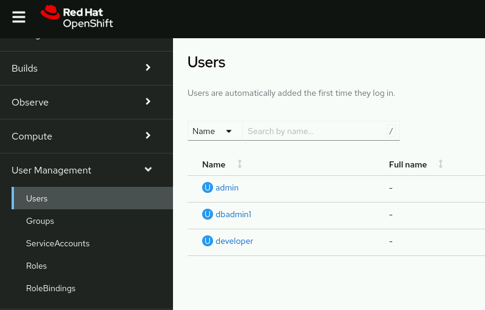
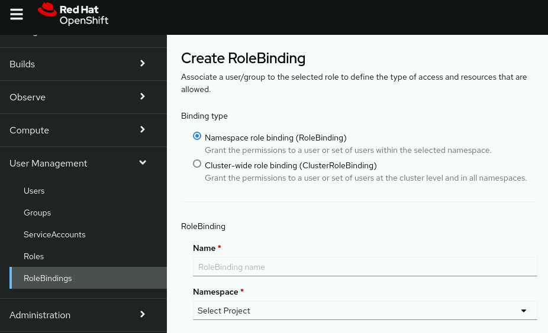
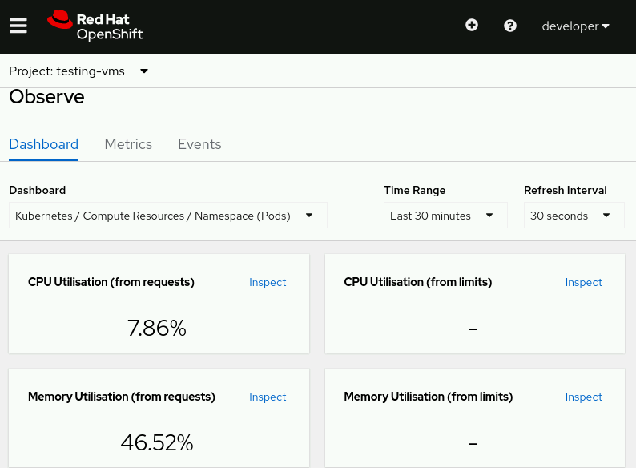
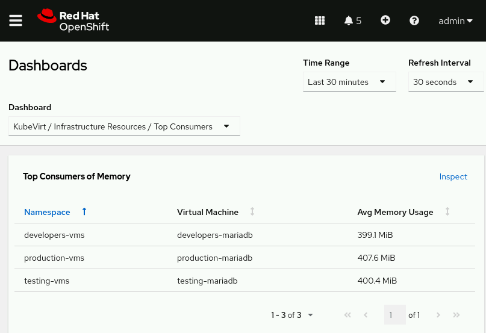

# Inspecting and Monitoring Virtual Machines

### Virtual Machine Monitoring

RHOCP provides a monitoring stack for cluster resources that is based on the open source Prometheus project.

Users can view details by using logging and monitoring dashboards for each VM in the OpenShift web console, similar to VMware's vCenter and Aria.

To view a VM's metrics, such as resource utilization and cluster-level events, use the OpenShift web console to navigate to Virtualization → VirtualMachines. Select the VM's project from the Projects menu and then click the VM's name to open the Overview tab for the VM.

The Details card on the Overview tab provides identifying information about the VM, including its name, status, date of creation, hostname, and operating system.

The Utilization card includes CPU, Memory, Storage, and Network Transfer usage charts. From this card, cluster administrators can select a duration for the utilization data.

The Overview tab provides additional cards to summarize hardware devices, alerts, snapshots, network interfaces, and disks.

In the developer perspective, cluster administrators can access the Observe menu to review dashboards with information about each project's resource utilization, such as usage metrics for CPU, memory, network, and storage I/O.

### Command-line Monitoring

The oc client is a command-line utility for managing RHOCP resources. Administrators and developers can use the oc command to develop, build, deploy, and run applications or VM workloads in Red Hat OpenShift. You can review and diagnose events and conditions for VM and storage resources. For example, cluster administrators can review a VM's logs from the virt-launcher pod to debug issues by using the oc logs command:

    [user@host ~]$ oc logs virt-launcher-name

Cluster administrators can also use the oc get and the oc describe commands to retrieve the status of all VMs in the cluster or a specific VM in a namespace.

As a cluster administrator, you can use the oc get command with the -A flag to list the status of all VMs in the cluster:

    [user@host ~]$ oc get vm -A

Use the following oc get command to retrieve the status of all VMs in a specific namespace:

    [user@host ~]$ oc get vm -n namespace

You can also use the oc describe command to retrieve detailed information for a VM, such as recent events and specifications:

    [user@host ~]$ oc describe vm vm-name -n namespace

As a cluster administrator, you can manage and inspect a VM by using virsh commands within the VM's virt-launcher pod and its libvirtd container.

Execute virsh commands to manage a VM from the console of the VM's virt-launcher pod by using either the OpenShift web console or the oc client. From the OpenShift web console, navigate to Workloads → Pods and select the VM's virt-launcher pod. Click the Console tab to open the pod's console. Use the following command to access the virt-launcher pod's console with the oc client:

    [user@host ~]$ oc exec -it virt-launcher-pod-name -n namespace -- /bin/bash

RHOCP 4.14 provides functions to the virtctl command that incorporate several virsh commands, to reduce the need to access the virt-launcher pod's console. For example, as a cluster administrator, you can view a list of file systems that are available to the VMI with the virtctl fslist vmi-name command.

    [user@host ~]$ virtctl fslist production-mariadb -n production-vms
    {
    "metadata": {},
    "items": [
        {
        "diskName": "vda2",
        "mountPoint": "/boot/efi",
        "fileSystemType": "vfat",
        "usedBytes": 6006784,
        "totalBytes": 104634368
        },
        {
        "diskName": "vda3",
        "mountPoint": "/",
        "fileSystemType": "xfs",
        "usedBytes": 2419097600,
        "totalBytes": 10619924480
        }
    ]
}

Additionally, you can view guest agent information about the VMI's operating system with the virtctl guestosinfo vmi-name command.

# Role-based Access Control

RHOCP uses role-based access control (RBAC) to grant permissions to cluster resources, including project monitoring.

RBAC is a technique for managing access to computer system resources. In Red Hat OpenShift, RBAC determines whether a user can perform certain actions within the cluster or project. You can choose between two role types, cluster or local, depending on the user's level of responsibility.

The authorization process is managed by rules, roles, and bindings.
| RBAC object  | Description                                                            |   |   |   |   |   |   |   |   |
|--------------|------------------------------------------------------------------------|---|---|---|---|---|---|---|---|
| Rule         | Allowed actions for objects or groups of objects.                      |   |   |   |   |   |   |   |   |
| Role         | Sets of rules. Users and groups can be associated with multiple roles. |   |   |   |   |   |   |   |   |
| Binding      | Assignment of users or groups to a role.                               |   |   |   |   |   |   |   |   |
|              |               

RHOCP defines two groups of roles and bindings according to the user's scope and responsibility: cluster roles and local roles.
| Role level   | Description                                                                       |
|--------------|-----------------------------------------------------------------------------------|
| Cluster role | Users or groups with this role level can manage the OpenShift cluster.            |
| Local role   | Users or groups with this role level can manage only elements at a project level. |

RHOCP includes several default cluster roles that you can bind to users. The following table lists some default cluster roles:

| Cluster role   | What users or groups with this role level can do                                                                            |
|----------------|-----------------------------------------------------------------------------------------------------------------------------|
| admin          | View any resource in a project and modify any project resource except for quotas.                                           |
| cluster-admin  | Perform any action in any project.                                                                                          |
| edit           | Modify most objects in a project, but cannot view or modify roles or bindings.                                              |
| view           | View most objects in a project, but cannot make any modifications. Users or groups cannot view or modify roles or bindings. |

OpenShift Virtualization extends the default cluster roles for virtualization resources. You can use these roles to grant permissions to developer users for virtualization resources in your cluster.

| Cluster role  | OpenShift Virtualization cluster role  | Description                                                                                                                                                             |
|---------------|----------------------------------------|-------------------------------------------------------------------------------------------------------------------------------------------------------------------------|
| view          | kubevirt.io:view                       | Users or groups with this role level can view all OpenShift Virtualization resources, but cannot create, delete, modify, or access the resources.                       |
| edit          | kubevirt.io:edit                       | Users or groups with this role level can modify all OpenShift Virtualization resources, but cannot modify the OpenShift Virtualization runtime configuration.           |
| admin         | kubevirt.io:admin                      | Users or groups with this role level have full permissions to all OpenShift Virtualization resources and can modify the OpenShift Virtualization runtime configuration. | | |

# Querying Virtual Resource Metrics

As a cluster administrator, you can monitor and query metrics on all projects in the cluster.

By default, developer users can monitor only projects where they have the view role permissions. Developer users can view monitoring information in the OpenShift web console by navigating to the Observe → Metrics menu. From there, a developer can run performance metric queries, one at a time.

Cluster administrators can grant permissions for additional projects to developer users.

As a cluster administrator, use the following command to grant view role permissions to a user:

    [user@host ~]$ oc create rolebinding view \
    --clusterrole=view --user=user -n project

To grant the view role permissions to a group, run the following command:

    [user@host ~]$ oc create rolebinding view \
    --clusterrole=view --group=group -n project

Alternatively, use the web console to add a role binding to a user. Log in to the web console as an Administrator, select the Administrator perspective, and go to User Management → Users.

Select a user to navigate to the user's details page. From the user details page, select the RoleBindings tab, and then click Create binding to access the Create RoleBinding page.

The fields on the Create RoleBinding page are identical to the fields in the oc create rolebinding command.

Enable monitoring for user-defined projects by setting the enableUserWorkload: true field in the cluster-monitoring-config configuration map in the openshift-monitoring namespace.

Cluster administrators can make this change:

    apiVersion: v1
    kind: ConfigMap
    metadata:
    name: cluster-monitoring-config
    namespace: openshift-monitoring
    data:
    config.yaml: |
        enableUserWorkload: true

Only cluster administrators have access to all namespaces concurrently in the Observe → Metrics interface. From the Developer perspective, you can navigate to Observe and then click the Dashboard tab to review various metrics, including CPU and memory usage charts, current network usage, bandwidth, and storage I/O for individual projects.

As a cluster administrator, you can navigate to Observe → Dashboards and then select the KubeVirt / Infrastructure Resources / Top Consumers dashboard from the Dashboard list. You can use this dashboard to review metrics for all VMs in the cluster and to identify the VMs that are consuming the most resources.

You can also access the Observe → Metrics interface to execute Prometheus Query Language (PromQL) queries against an entire Red Hat OpenShift Virtualization environment. Use this tool to examine information about the cluster and user-defined workloads as a dashboard or a graph.

Various metrics can help administrators and developers when writing PromQL queries for virtualization monitoring:

    kubevirt_vmi_vcpu_wait_seconds
Returns the wait time (in seconds) for a VM's vCPU.

    kubevirt_vmi_network_receive_bytes_total
Returns the total amount of traffic received (in bytes) on the VM's network.

    kubevirt_vmi_network_transmit_bytes_total
Returns the total amount of traffic transmitted (in bytes) on the VM's network.

    kubevirt_vmi_storage_read_traffic_bytes_total
Returns the total amount of storage read (in bytes) by the VM.

    kubevirt_vmi_storage_write_traffic_bytes_total
Returns the total amount of storage writes (in bytes) of the VM's storage related traffic.

    kubevirt_vmi_storage_iops_read_total
Returns the amount of read I/O operations the VM is performing per second.

    kubevirt_vmi_storage_iops_write_total
Returns the amount of write I/O operations the VM is performing per second.

    kubevirt_vmi_memory_swap_in_traffic_bytes_total
Returns the total amount (in bytes) of memory the virtual guest is swapping in.

    kubevirt_vmi_memory_swap_out_traffic_bytes_total
Returns the total bytes of memory that the virtual guest is swapping out.