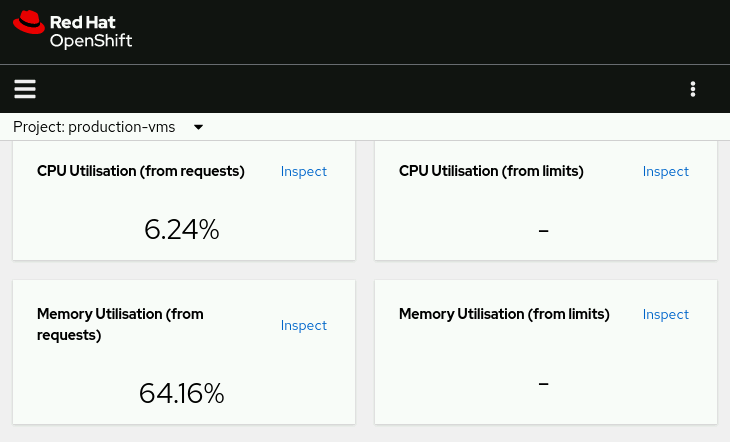
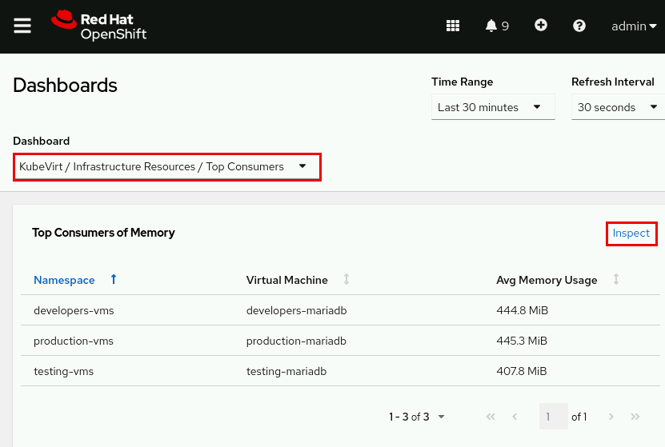
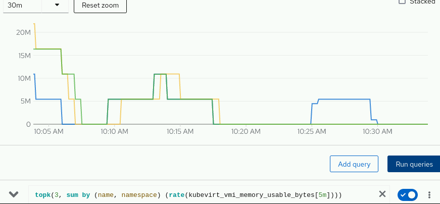

# Guided Exercise: Inspect and Monitor Virtual Machines

### Outcomes

- Inspect the current RBAC policies of different projects.

- Use RBAC policies to permit a non-cluster administrator to view the performance metrics of virtual machines in a project.

- Retrieve performance metrics from virtual machines by using the Red Hat OpenShift web console and PromQL syntax.

### Instructions

  Grant permissions to the developer user to retrieve metrics of the VMs in different projects. Create a role binding to assign the view cluster role to the developer user in each of the three projects. Use view as the name for each new role binding.

Use the command line to log in to your Red Hat OpenShift cluster as the admin user.
[student@workstation ~]$ oc login -u admin -p redhatocp \
  https://api.ocp4.example.com:6443
Login Successful
...output omitted...

List the current role bindings of the developers-vms, production-vms, and testing-vms projects.
[student@workstation ~]$ oc get rolebindings -n developers-vms
NAME                    ROLE                               AGE
system:deployers        ClusterRole/system:deployer        2h
system:image-builders   ClusterRole/system:image-builder   2h
system:image-pullers    ClusterRole/system:image-puller    2h

[student@workstation ~]$ oc get rolebindings -n production-vms
NAME                    ROLE                               AGE
system:deployers        ClusterRole/system:deployer        2h
system:image-builders   ClusterRole/system:image-builder   2h
system:image-pullers    ClusterRole/system:image-puller    2h

[student@workstation ~]$ oc get rolebindings -n testing-vms
NAME                    ROLE                               AGE
system:deployers        ClusterRole/system:deployer        2h
system:image-builders   ClusterRole/system:image-builder   2h
system:image-pullers    ClusterRole/system:image-puller    2h

Use the oc create command to create the view role binding in the developers-vms project.

[student@workstation ~]$ oc create rolebinding view \
  --clusterrole=view --user=developer -n developers-vms
rolebinding.rbac.authorization.k8s.io/view created

Confirm that the developer user has the assigned permissions on the developers-vms projects.

[student@workstation ~]$ oc get rolebindings view -n developers-vms -o wide
NAME   ROLE               AGE   USERS       GROUPS   SERVICEACCOUNTS
view   ClusterRole/view   2m    developer

Assign the view cluster role binding to the other two projects.

[student@workstation ~]$ oc create rolebinding view \
  --clusterrole=view --user=developer -n production-vms
rolebinding.rbac.authorization.k8s.io/view created

[student@workstation ~]$ oc create rolebinding view \
  --clusterrole=view --user=developer -n testing-vms
rolebinding.rbac.authorization.k8s.io/view created

Confirm that the developer user has the assigned permissions on the other two projects.

[student@workstation ~]$ oc get rolebindings view -n production-vms -o wide
NAME   ROLE               AGE   USERS       GROUPS   SERVICEACCOUNTS
view   ClusterRole/view   2m   developer

[student@workstation ~]$ oc get rolebindings view -n testing-vms -o wide
NAME   ROLE               AGE   USERS       GROUPS   SERVICEACCOUNTS
view   ClusterRole/view   2m   developer

As the developer user, log in to the OpenShift web console.
Open a web browser and navigate to https://console-openshift-console.apps.ocp4.example.com.
Click htpasswd_provider and log in as the developer user with developer as the password.
If the Developer view is not already active, then use the perspective switcher to select this view.
Observe the metrics dashboard for the production-vms project as the developer user.
From the OpenShift web console left panel, navigate to Observe.
From the Project drop-down menu, select the production-vms project.
Read through the performance metrics. Set the time range to Last 5 minutes for a more granular view.

        
        The performance metrics are for all pods in the project, including the virt-launcher pod.

    View the CPU usage as the developer user for the VM that is running in the production-vms project.

        Scroll down to the CPU Usage graph.
        Figure 2.22: CPU Usage metrics production

    Generate resource loads on all VMs.

        From the OpenShift web console left panel, select the Administrator perspective. Navigate to Virtualization → VirtualMachines and change to the developers-vms project.

        Click developers-mariadb and click the Console tab. Log in with the guest credentials above the console prompt.

       

        Execute the stress-load.sh script in the home directory of the developer user to generate stress load on the virtual machine. The script takes approximately two minutes to complete. You can proceed to the next step while the script executes.

        [developer@developers-mariadb ~]$ ./stress-load.sh
        stress: info [1847] dispatching hogs: 2 cpu, 2 io, 4 vm, 6 hdd
        stress: info [1847] successful run completed in 120s

        Return to the OpenShift web console and change to the production-vms project. Click production-mariadb and click the Console tab. Open the VNC console of the production-mariadb virtual machine and log in with the guest credentials above the console prompt.

        Execute the stress-load.sh script in the home directory of the developer user to generate a stress load on the virtual machine. The script takes approximately two minutes to complete. You can proceed to the next step while the script executes.

        [developer@production-mariadb ~]$ ./stress-load.sh
        stress: info [1772] dispatching hogs: 8 cpu, 6 io, 1 vm, 2 hdd
        stress: info [1772] successful run completed in 120s

Navigate to Virtualization → VirtualMachines and change to the testing-vms project. Click testing-mariadb and click the Console tab to open the virtual machine console. Log in with the guest credentials above the console prompt.

Execute the stress-load.sh script in the home directory of the developer user to generate a stress load on the virtual machine. The script takes approximately two minutes to complete. You can proceed to the next step while the script executes.

  [developer@testing-mariadb ~]$ ./stress-load.sh
  stress: info [1768] dispatching hogs: 6 cpu, 8 io, 1 vm, 4 hdd
  stress: info [1768] successful run completed in 120s

As the admin user, log in to the OpenShift web console.

- Click User at the top right of the window and click Log out.
- Click htpasswd_provider and log in as the admin user with redhatocp as the password.

Use the Observe → Dashboards interface to retrieve updated performance metrics for all VMs in the production-vms, developers-vms, and testing-vms projects.

From the Administrator perspective, navigate to Observe → Dashboards
Select the KubeVirt / Infrastructure Resources / Top Consumers option from the Dashboard menu. You can use this dashboard to identifthe top consumers of memory, of CPU by virt-launcher pods, of storage IOPs, and so on. Examine the reported metrics for the VMs. Eacpanel includes an Inspect button that opens a Metrics page with the PromQL query that the panel executes. Click the Inspect button tview the executed PromQL query for the Top Consumers of Memory panel.

